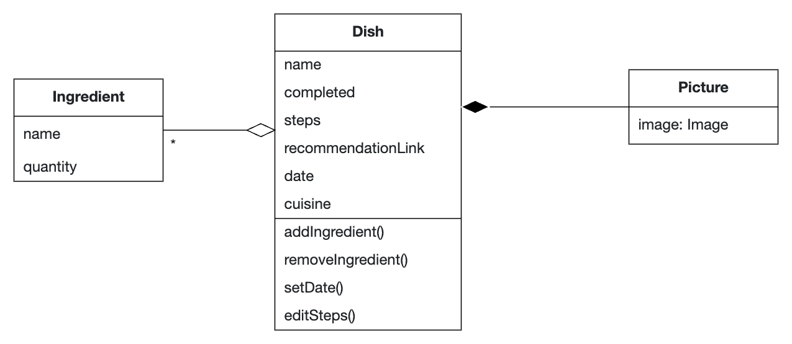
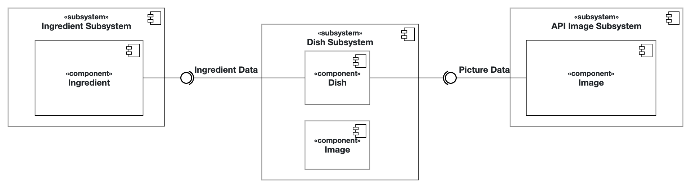

# Intro Course Project App of Marcel Giovanni Munaba for the iPraktikum

To pass the intro course, you need to create your own unique iOS app (based on SwiftUI).

There are no requirements regarding the functions of your app, so you can get creative.
However, we provide you with Non-Functional Requirements (NFR) that your app needs to fulfill.

After each day of learning new Swift and SwiftUI concepts, these NFRs may change, or new NFRs get added.

## Submission procedure

You get a **personal repository** on Gitlab to work on your app.

Once you implemented a new feature into your app, you need to create a Merge Request (MR - Sometimes we will also reference these as "Pull Requests"(PR)) to merge your changes from the feature branch into your main branch.

Your tutor will review your changes and either request changes or approves the MR.

If your MR got approved, you also need to merge it!

### Deadline: **15.10.2024 23:59**

Until the deadline all of your PRs **need to be merged** and your final app **needs to fulfill** all of the requested NFRs!

---

## Problem Statement (max. 500 words)

As a student living abroad far from home, I always try to cook for myself. Over time, I have grown fond of cooking and enjoy trying out different cuisines. While scrolling through social media, I often come across many dishes that I wish to try making. The list of dishes has grown longer and longer, but due to external constraints like time, I often forget to make any of them. This problem also extends to my grocery shopping, where I frequently forget an ingredient or two for a specific dish.

To help me with this, I need an iOS application that can create a list of dishes I wish to try to cook, including their ingredients. The main page of this app should consist of two sections: a list of draggable cards with brief details representing each dish and another section for all the completed ones. The app should let me sort the priority of each dish, starting with the one I am most interested in by dragging the card to the top.  Additionally, it would include a checklist (or a DONE button) for every dish. For the completed ones, the cards should not be draggable.

The app should let me edit and delete dishes from the list. Each page for a dish should contain its name, ingredients, basic steps, a picture, and a reference recommendation (such as YouTube or Google). Every time I finish a dish, the app would ask if I want to save my own picture of the dish to its page. Whenever I want to revisit my completed meals, I could also look at a picture of my self-made dish.

## Requirements

Functional Requirements : 
- Stores a list of dishes to cook including their ingredients and their basic steps
- Prioritize certain dish, making them appear at the top of the list
- Mark a dish as complete
- Save completed dishes for further reference
- Add dishes to the list
- Edit existing dishes
- Delete existing dishes
- Provide reference recommendations from the Internet
- Display a picture of the dish, both a generic picture and a user-uploaded one

## Analysis

## System Design

## Product Backlog

MAHLZEIT-1 - Add a new dish - X\
MAHLZEIT-2 - Randomize an example when creating a new dish - X\
MAHLZEIT-3 - Mark a dish as complete - X\
MAHLZEIT-4 - Edit a dish’s details\
MAHLZEIT-5 - Remove an existing dish\
MAHLZEIT-6 - Display a recommended link - X\
MAHLZEIT-7 - Add a picture - X\
MAHLZEIT-8 - Prioritize a certain dish - X
